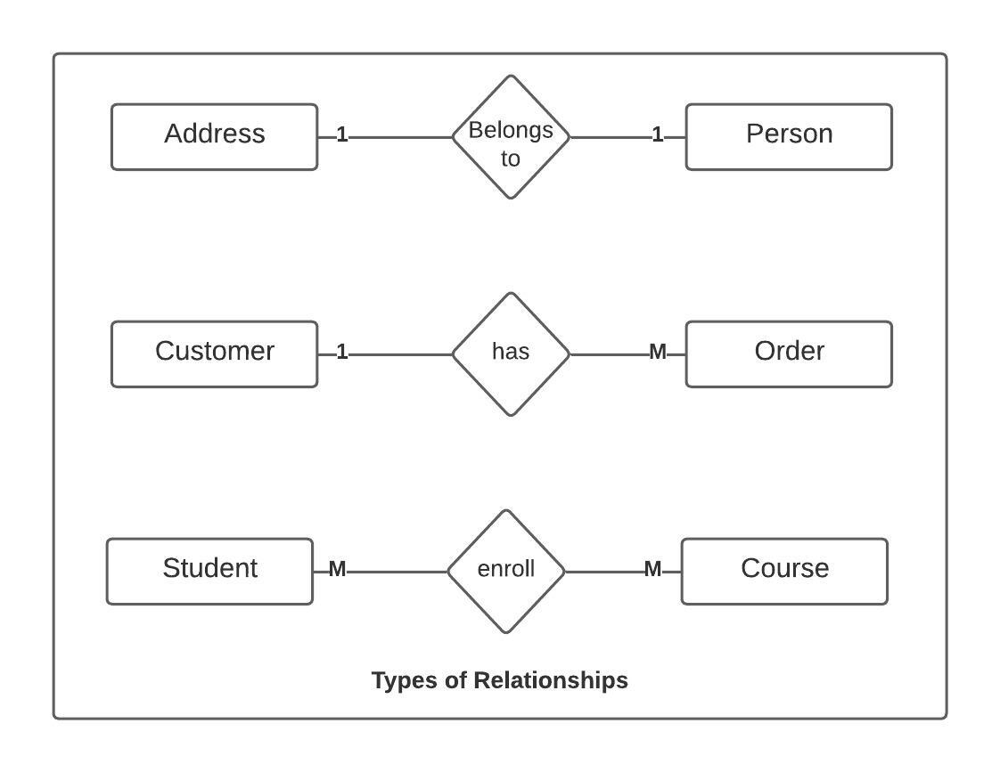
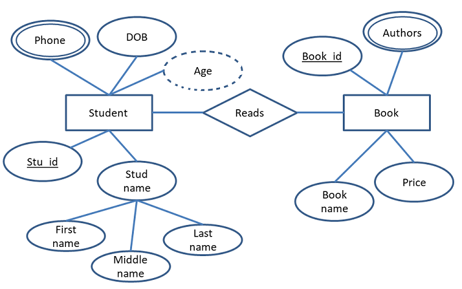

# Introduction: Relational vs. Non-Relational

When it comes to storing data, there are two main types of databases: 
- Relational 
- Non-relational

***Relational databases:*** 
Store data in `tables with predefined relationships` between them. they are <u>less flexible and more difficult to scale</u>.

<br>

***Non-relational databases:*** 
Designed to store data in a `more flexible and scalable` way. They can handle large amounts of `unstructured data`, and are often used for applications that require high availability and `fast access` to data.

<br>

## Schema Design Principles II
Relationship Types
In a relational database, there are three main types of relationships: 
<span style="color:white">***One to One, One to Many, and Many to Many***.</span>

<span style="color:coral">***One to One***:</span> 
This is a relationship where one record in a table is related to one record in another table. 
For example, a person might have one address, and that `address belongs to only one person`.

<span style="color:coral">***One to Many***:</span> 
This is a relationship where one record in a table is related to many records in another table. 
For example, `a customer might have multiple orders`, but each order belongs to only one customer.

<span style="color:coral">***Many to Many***:</span> 
This is a relationship where <u>many records in one table are related to many records in another table</u>. 
For example, `a student might be enrolled in many courses, and each course has many students`.

<br>

## Charting out Relations: Entity Relation Diagrams
- When designing a database schema, it's important to chart out the relationships between tables. This is typically done using an `Entity Relation Diagram` (ERD), which is a graphical representation of the relationships between tables.

- An `ERD` shows the `tables in the database`, as well as the `fields in each table` and the `relationships between them`. This can help you to identify any potential issues with your schema design and ensure that the relationships between tables are clear and well-defined.



## Implementing Relations in MongoDB:
- To create relationships in MongoDB with Mongoose, use the `ref` schema option.
- The ref schema option `allows you to specify a reference` to another document in the database, which can be used to populate related data when needed.

Here an example
Suppose we have two entities: a `User` and a `BlogPost`. A User can have many BlogPosts, but a BlogPost belongs to only one User. We can define these entities as Mongoose schemas:

```js
const mongoose = require('mongoose');

const userSchema = new mongoose.Schema({
  name: { type: String, required: true },
  email: { type: String, required: true },
});

const blogPostSchema = new mongoose.Schema({
  title: { type: String, required: true },
  content: { type: String, required: true },
  user: { type: mongoose.Schema.Types.ObjectId, ref: 'User', required: true },
});
```

<br>


## Creating Relations: Updating Our Project's Controllers

### Endpoints for Multiple Resources: 

When creating `REST endpoints`, it's important to consider the relationships between resources. 
If multiple resources are related, it's often useful to create endpoints that allow you to access them together.

- For example, if you have a database schema where `a user can have multiple posts`, you might want to ***create endpoints that allow you to retrieve all of the posts for a given user***.

Here an example:

```js
//schema for user
const userSchema = new mongoose.Schema({
  name: {
    type: String,
    required: true
  },
  email: {
    type: String,
    required: true,
    unique: true
  }
});

//schema for post
const postSchema = new mongoose.Schema({
  title: {
    type: String,
    required: true
  },
  content: {
    type: String,
    required: true
  },
  author: {
    type: mongoose.Schema.Types.ObjectId,
    ref: 'User',
    required: true
  }
});

const User = mongoose.model('User', userSchema);
const Post = mongoose.model('Post', postSchema);
```

Here an example route for all posts for a specific userId
```js
// get all posts for a given user
app.get('/users/:userId/posts', async (req, res) => {
  try {
    const userId = req.params.userId;

    //get a user with the given userid
    const user = await User.findById(userId);
    if (!user) {
      throw createError.NotFound('User not found');
    }

    //get all posts for the selected user
    const posts = await Post.find({ author: user._id });
    res.send(posts);

  } catch (error) {
    next(error);
  }
});
```

<br>

## Adding Additional Entities: The Entity Creation Chain

<span style="color:coral">When adding additional entities to a database schema, it's important to consider how the new entity will relate to the existing entities.</span> 

- For example, if you have a database schema that includes `users` and `posts`, and you want to `add a new entity for comments`, you'll need to consider __how comments will be related to both users and posts__.

- One way to handle this is to `create a new model for comments that includes references` to both the user and post models. This can be done using the ref schema option in Mongoose.

Here an example:
```js
// <!-- --------------------------- User ---------------------------- -->
const userSchema = new mongoose.Schema({
  name: {
    type: String,
    required: true
  },
  email: {
    type: String,
    required: true,
    unique: true
  }
});

// <!-- --------------------------- Post ---------------------------- -->
const postSchema = new mongoose.Schema({
  title: {
    type: String,
    required: true
  },
  content: {
    type: String,
    required: true
  },
  author: {
    type: mongoose.Schema.Types.ObjectId,
    ref: 'User',
    required: true
  }
});

// <!-- -------------------------- Comment -------------------------- -->
const commentSchema = new mongoose.Schema({
  content: {
    type: String,
    required: true
  },
  author: {
    type: mongoose.Schema.Types.ObjectId,
    ref: 'User',
    required: true
  },
  post: {
    type: mongoose.Schema.Types.ObjectId,
    ref: 'Post',
    required: true
  }
});

const User = mongoose.model('User', userSchema);
const Post = mongoose.model('Post', postSchema);
const Comment = mongoose.model('Comment', commentSchema);

```

Example of inserting data in the above data models
```js
// <!-- ------------------- create a new user -------------------- -->
app.post('/users', async (req, res) => {
  try {
    const user = new User(req.body);
    await user.save();
    res.status(201).send(user);
  } catch (error) {
    next(error)
  }
});

// <!-- ----------- create a new post for a given user ----------- -->
app.post('/users/:userId/posts', async (req, res) => {
  try {
    const userId = req.params.userId;

    //find user by userId
    const user = await User.findById(userId);
    if (!user) {
      throw createError.NotFound('User not found!');
    }
    const post = new Post({
      ...req.body,
      author: user._id
    });
    await post.save();
    
    res.status(201).send(post);
  
  } catch (error) {
    next(error)
  }
});

// <!-- ------ create a new comment for a given post and user ------- -->
app.post('/users/:userId/posts/:postId/comments', async (req, res) => {
  try {
    const {userId, postId} = req.params;

    const user = await User.findById(userId);
    const post = await Post.findById(postId);
    if (!user || !post) {
      throw createError.NotFound('User or Post not found!');
    }
    const comment = new Comment({
      ...req.body,
      author: user._id,
      post: post._id
    });
    
    await comment.save();
    
    res.status(201).json({user, post, comment})
    
  }catch(error){
    next(error)
  }
});  
```
<br>


---
<br>

## Deleting Shared Entities: The Entity Deletion Chain
- When deleting shared entities, it's important to `consider the relationships between the entities`. 
  
- You may need to update your controllers to ensure that the <span style="color:coral">deletion of the shared entity does not break the relationships with the remaining entities</span>.
-  This may involve deleting related entities as well, in a `specific order or chain.`

<br>

__Here an Example:__

Let's say you have an API for a social media with `USER`, `POST` and `COMMENT`, and you need to `delete a user's account`. The user account is a shared entity that has relationships with other entities, such as `POST and COMMENT`. Here's how you might go about deleting the account using the entity deletion chain:

1. ***Identify all relationships and dependencies:*** 
   Before deleting the user account, you would need to `identify all the related entities` that depend on it. In this case, you would identify POST and COMMENT as entities that depend on the user account.

2. ***Check dependencies for each entity:***
   For each dependent entity, you would need to check if it has any relationships or dependencies that need to be addressed before deletion. For example, `for each POST associated with the user account, you would need to check if it has any related COMMENT.`

3. ***Follow the entity deletion chain recursively:*** 
   If there are any dependencies, you would follow the entity deletion chain recursively until all dependencies have been handled. 
   
   For example, if POST has a related COMMENT, you would need to delete the COMMENT first before deleting the POST.

4. ***Delete the original shared entity:*** 
   Once all dependencies have been handled, you can safely delete the user account.

