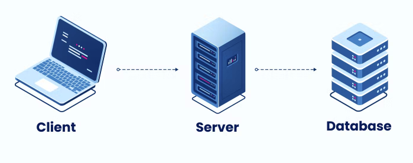
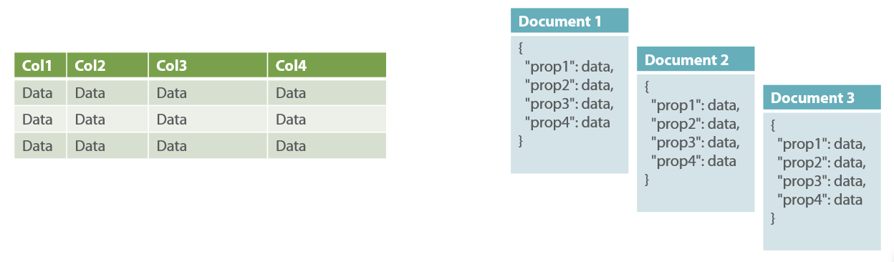

# Introduction to Database  

## What is a database?
__A database is a `collection of organized data` that is easily accessible, managed, and updated.__  
It can be used to store and retrieve information for various purposes, such as <u>business operations, research</u>, and more.



## Why do wee need Database?
Here are some reasons why you might need a database:

-  __Storing and retrieving data:__  
  Databases are an ***efficient way to store and retrieve large amounts of data***.  
  For example, if you have a website that needs to store user information such as <u>usernames</u>, <u>passwords</u>, and <u>contact information</u>, you could use a database to store that data and retrieve it quickly when needed.

- __Sorting and filtering data:__  
  Databases can be used to ***sort and filter data based on specific criteria***.  
  For example, you could use a database to <u>sort customer information by age</u>, location, or purchase history.

- __Managing transactions:__  
  Databases can ***help manage transactions by ensuring data is consistent and accurate***.  
  For example, if you have a retail website that processes online orders, a database can <u>ensure that the inventory levels are accurate</u> and the customer's payment information is securely stored.

- __Scalability:__  
  Databases can be scaled to ***handle large amounts of data and high levels of traffic***. As your business grows and you need to store more data, a database can help you manage that growth.

<div style="border-left: 5px double gray; padding-left: 10px; margin:3rem;">
Overall, a database can help you organize and manage your data, making it easier to access, analyze, and use. Whether you're running a small business or a large enterprise, a database can be an essential tool for managing your data effectively.  
</div>


## Table based (csv) vs. Document based (json)
- Table-based databases, such as CSV files, store data in tables with  `rows` and `columns`.  

- In contrast, document-based databases, such as JSON files, store data as `collections of documents`. 
  
    => Document-based databases allow for more `flexible and dynamic data structures.`

    

## SQL vs. NoSQL
- ***SQL (Structured Query Language):*** is a traditional relational database management system that uses tables, columns, and rows to store data. 
  
- ***NoSQL:*** is a non-relational database system that allows for more flexible and scalable data storage. 

- ***Note:*** SQL is good for handling structured data while NoSQL is better for unstructured data.


## DB Install: Setup the Environment
### Shell  
1. ***The mongo shell:*** accessing mongodb through the terminal  
The mongo shell allows you to access and manage MongoDB through the terminal. You can use commands like `mongo` to connect to a MongoDB instance, and `use <db name>` to switch to a specific database.

1. ***The mySQL shell***: writing queries in the terminal  
The mySQL shell allows you to write and execute SQL queries in the terminal. You can use commands like `mysql -u <user> -p` to connect to a MySQL server, and `USE <db name>;` to switch to a specific database.


## Creating and using Databases
Both mongo and mySQL shells allow you to create and use databases.
In mongo you can use:

```sql 
show dbs;
use <db name>;
```
to switch to a specific database, while in mySQL, you can use the commands
```sql
CREATE DATABASE <db name>;
USE <db name>;
```
to create and switch to a database, respectively.

<br/>

## Table / Collection: Shell Example
***Concept overview: "A place to keep records"***  
A table or collection is a container that holds <u>records or documents</u>. It is used to organize and store data in a structured way.

- Creating a collection in mongo: 
    ```sql
    db.createCollection(); 
    show collections;
    ```

    In mongo, you can create a new collection using the above command and view all collections in the current database.

- Creating a table in SQL: 
    ```sql
    CREATE TABLE <table name> (<column definitions>); 
    SHOW TABLES;
    ```

In SQL, you can create a new table using the CREATE TABLE <table name> (<column definitions>); command and view all tables in the current database using SHOW TABLES;.

### Difference I: 
SQL requires structure, 
```sql
DESCRIBE <table name>;
```
SQL requires that you define the structure of your table upfront, which includes __specifying the columns and their data types__.

## Row / Document: Shell Examples
Concept overview: 
- A single record in a collection/table.
- A row or document represents a single record in a table or collection. 
- It contains data for each field or column in the table or collection.

<!-- 
 -->