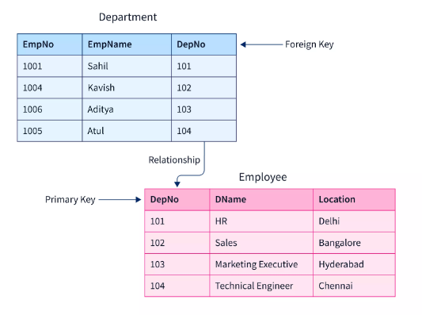

# Introduction to Database
<hr>

### Today we will learn about:
- The concepts of `rows/documents`, `columns/field`s, and `keys` or ids in databases
- The four primary data `operations of CRUD`, including creating, retrieving, updating, and deleting data
- Using GUIs for databases, such as `Compass for MongoDB` and `Workbench` for MySQL
---

## Row / Document: Shell examples

- "Row / Document is a ***single record*** in a collection / table"

In the world of databases, a row in SQL and a document in MongoDB refer to a single record in a table or collection, respectively.  
Both are representations of the same concept - __a single entry of data in a database.__

<br>

### Inserting a document in MongoDB: 
To insert a document in MongoDB, you can use the insertOne() method.
```js
db.<collection>.insertOne(<document>);
```

Here's an example:

```js
db.customers.insertOne({
    name: "John Smith",
    email: "john.smith@example.com",
    phone: "123-456-7890"
})

//insert multi documnet
db.customers.insertMany([
    {name: "John Doe", email: "john@mail.com", phone:"123-456-3423"},
    {name: "Jane Doe", email: "jane@mail.com", phone:"123-456-34233}
    ])

```

<br>

### Inserting a row in MySQL: 

To insert a row in MySQL, you can use the INSERT INTO statement. 
```sql
/* insert single record */
INSERT INTO <table_name> VALUES (<values>);
/* insert multi record */
INSERT INTO <table_name> VALUES (<values>), (<values>), (<values>);

```

Here's an example:  

```sql
INSERT INTO customers (name, email, phone) VALUES ('John Smith', 'john.smith@example.com', '123-456-7890');
```

<br>

### Difference II: MongoDB implicitly creates collections with `.insertOne()`

- One key difference between MongoDB and MySQL is that MongoDB implicitly creates collections when you insert a document. In contrast, with MySQL, you need to create the table first before you can insert any data.

<hr>

## Column / Field: Shell examples

- A `column` in SQL and a `field` in MongoDB refer to a __single value in a row or document__, respectively. In other words, a column or field ***represents a specific piece of data that is associated with a particular record***.

### Showing all documents in MongoDB: 

- To retrieve all documents in a MongoDB collection, you can use the `find()` method with an empty query object. 
  
    ```js
    db.<collection>.find({});
    ```
    
    Here's an example:  

    ```js
    db.customers.find({
        price: {$lt: 500}
    });
    ```

### Showing all rows of a table: 

- To retrieve all rows in a MySQL table, you can use the SELECT statement with the * wildcard. 
  
    ```sql
    SELECT * FROM <table name> WHERE <conditions>;
    ```

    Here's an example:

    ```sql
    SELECT * FROM customers;
    ```
<hr>

## Key / Id: Shell examples


- In both SQL and MongoDB, a key or id `uniquely identifies a record` in a table or collection, respectively. This allows you to retrieve or modify specific records in the database.

    


### Difference III: MongoDB implicitly provides unique ids

Unlike in MySQL, where you need to explicitly define and manage your ids, MongoDB implicitly creates unique ids for every document you insert. This makes it easier to insert new records without worrying about conflicting ids.

### Adding Ids to SQL:

- To add ids to a MySQL table, you need to define a column with the `AUTO_INCREMENT` attribute. Here's an example:

    ```sql
    CREATE TABLE customers (
        id INT NOT NULL AUTO_INCREMENT,
        name VARCHAR(50),
        email VARCHAR(50),
        phone VARCHAR(20),
        PRIMARY KEY (id)
    );
    ```
<br>
<hr>

## CRUD: Four Primary Data Operations
- CRUD stands for `Create`, `Retrieve`, `Update`, and `Delete`, which are the four __primary data operations__ used in databases. These operations are used to manage data in a database.

### Create: Inserting Single and Multiple Rows/Documents
- In MongoDB, we can insert document to collections using `insertOne()` and insert multiple documents at once using the `insertMany()` method. The syntax for inserting single/multiple documents in a collection is as follows:

    ```js
    //for single document
    db.<collection>.insertOne({documnet});
    //for multiple documents
    db.<collection>.insertMany([{ <document 1> }, { <document 2> }, <...>]);
    ```
<br>

- In SQL, we can insert single/multiple rows at once using the INSERT INTO statement. The syntax for inserting multiple rows in a table is as follows:

    ```sql
    /* single row */
    INSERT INTO <table> VALUES (<row>);
    /* multi row */
    INSERT INTO <table> VALUES (<row 1>), (<row 2>), <...>;
    ```

### Retrieve: Querying the Table/Collection by Criteria
- In MongoDB, we can retrieve data from a collection by using the `find()` method. The syntax for querying a collection based on criteria is as follows:

    ```js
    db.<collection>.find({ <field name>: { criteria } });
    ```
<br>


- In SQL, we can retrieve data from a table by using the `SELECT` statement. The syntax for querying a table based on criteria is as follows:

    ```sql
    SELECT * from <table> WHERE <criteria>;
    ```
<br>

### Update: Updating a Row/Document
- In MongoDB, we can update a document in a collection using the `updateOne()` method. The syntax for updating a document based on criteria is as follows:

    ```js
    db.<collection>.updateOne({ <criteria>, {$set: <values> });
    ```

<br>

- In SQL, we can update a row in a table using the `UPDATE` statement. The syntax for updating a row based on criteria is as follows:

    ```sql
    UPDATE <table> SET <values> WHERE <criteria>;
    ```

<br>

### Delete: Deleting a Row/Document
- In MongoDB, we can delete a document in a collection using the `deleteOne()` method. The syntax for deleting a document based on criteria is as follows:

    ```php
    db.<collection>.deleteOne({ <criteria> });
    ```

<br>

- In SQL, we can delete a row in a table using the DELETE FROM statement. The syntax for deleting a row based on criteria is as follows:

    ```sql
    DELETE FROM <table> WHERE <criteria>;
    ```

<hr>
<br>

## Watching the DB: The DB GUI
- A DB GUI, or database graphical user interface, is a software tool that allows users to interact with databases using a graphical interface. There are several popular DB GUI tools available for different database management systems.

- ***MongoDB Compass***  
Compass is the official graphical user interface (GUI) for MongoDB, which provides a visual representation of the data in your database. It can be used to `explore`, `manipulate`, and `visualize` your MongoDB data.

### Installing Compass
Compass can be downloaded from the official MongoDB website for free. It is available for `Windows, Mac, and Linux` operating systems. For installation guideline [Click here](https://www.mongodb.com/docs/compass/current/install/).

### Connecting to a MongoDB Database
To connect to a MongoDB database using Compass, follow these steps:

1. Open Compass and click on "New Connection".  
2. Enter the connection details, including the `hostname`, `port`, and `database name`. (e.g  mongodb://localhost:27017/dbname)
Optionally, you can specify authentication details and SSL options.
1. Click on "Connect".
2. Once connected, Compass will display a list of the databases in your MongoDB server, and you can select the one you want to work with.

### Features of Compass
Compass provides several features to manage and visualize your MongoDB data, including:

1. __Data exploration and filtering:__  
   You can explore your data using an intuitive tree view and filter it based on specific criteria.

2. __Querying:__  
   Compass provides a built-in query editor that allows you to write queries in MongoDB's native query language.

3. __Index management:__  
   You can manage indexes on your collections, including creating, modifying, and deleting them.

4. __Schema visualization:__  
   Compass provides a graphical representation of your database schema, including relationships between collections.

5. __Data manipulation:__  
   You can add, edit, and delete documents in your collections using Compass's intuitive interface.

6. __Performance analysis:__  
   Compass provides real-time performance metrics and visualizations to help you optimize your database performance.

Overall, Compass is a powerful tool that makes it easy to manage your MongoDB databases visually, without needing to know MongoDB's command-line interface.


<!-- 
 -->