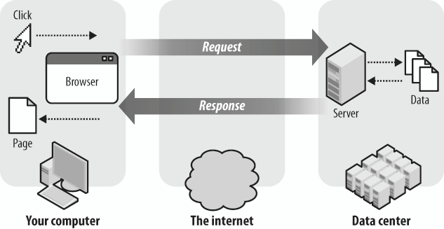

# Introduction
What is a server?
A server is a program that provides services to other `programs`, `devices`, or `users on a network`. The services provided by a server can range from simple **file sharing** to complex **web applications** and its interaction with clients.

## The Server as a program

A server is a computer program that runs on a server machine and provides services to other programs or devices connected to the network. The services provided by a server can include `file sharing`, `data storage`, `email`, `web hosting`, and more.   
Servers can be either __physical machines__ or __virtual machines__ hosted on a cloud-based infrastructure.

## CLIENT-SERVER concept: 
In a web application, the client sends a request to the server for a particular service or resource. The server processes the request and sends back a response to the client. This interaction between the client and the server is known as the ***request-response cycle***.

The client and the server communicate using the Hypertext Transfer Protocol (HTTP). The client sends an HTTP request to the server, which includes information such as the requested resource, the HTTP method used, and any additional data required by the server to process the request.

The server receives the request, processes it, and sends back an HTTP response to the client. The response contains the requested resource, along with any additional data required by the client.

## The role of the backend in real life apps
The backend of a web application is responsible for 
- Processing and storing data
- Managing user authentication and authorization, and 
- Providing services to the client through APIs
     
In real-life applications, the backend is critical for the proper functioning of the application.

For example, in an `e-commerce application`, the backend manages 
- user accounts, 
- stores product information and orders,
- processes payment transactions. 
  
Similarly, in a `social media application`, the backend manages 
- user profiles, 
- stores posts and comments, 
- provides recommendations to users based on their activity.

In conclusion, the server plays a vital role in the interaction between clients and web applications. Understanding the server-client concept and the role of the backend in real-life applications is crucial for developers building web applications.

## Summary
- A server provides services to programs, devices, or users on a network, from file sharing to web applications.
- The client sends a request to the server using HTTP, and the server sends back a response.
- The backend of a web app manages data, authentication, and APIs, crucial for e-commerce and social media.
- Developers building web apps must understand the server-client concept and the backend's role.
<!-- 
 -->